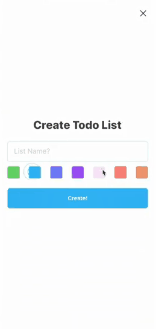

<h1 align="center">&lsaquo;Dev&rsaquo;<span style="color: blue">Todo</span></h1>


<h2>Description</h2>

<p><b>&lsaquo;Dev&rsaquo;</b><span style="color: blue">Todo</span> is a project that i'm developing by the <a href="https://www.youtube.com/c/DesignIntoCode" target="_blank">Design into code</a> channel, using the react native and firebase technologies.   

---

<p align="center">
  
</p>

<h2>How to execute?</h2>
<h5>Download / Clone the repository</h5>

```
git clone https://github.com/devisceral/devtodo.git
```
